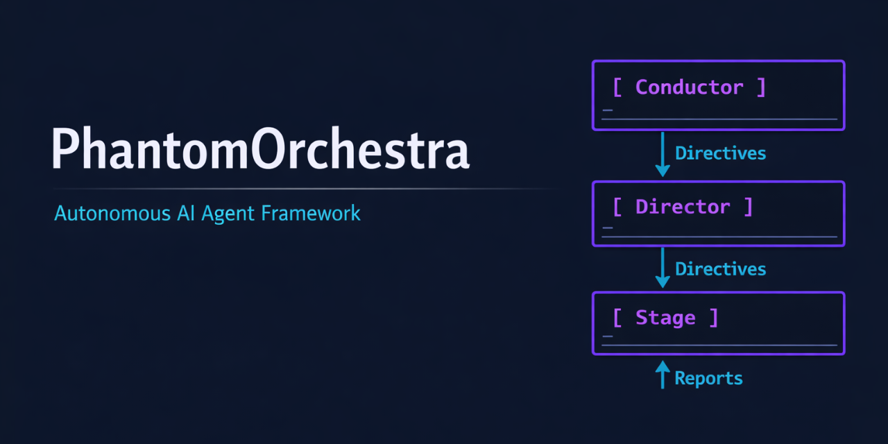
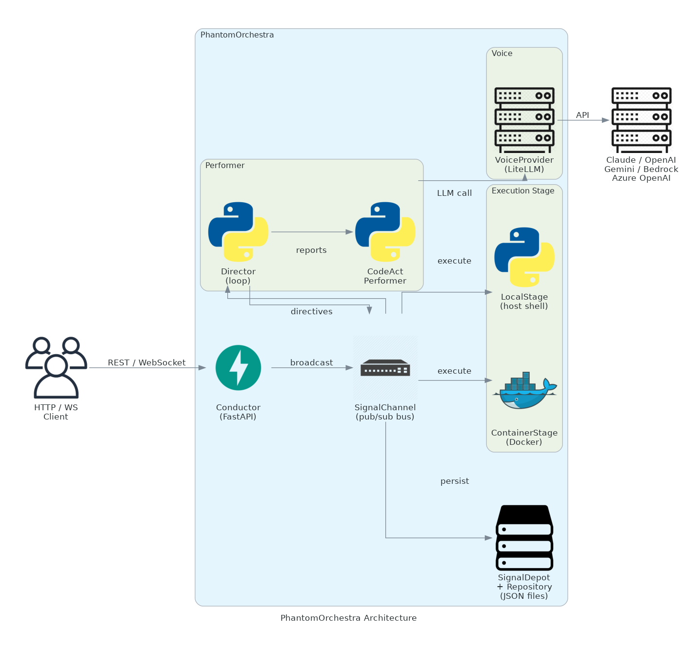

<p align="center"></p>

<h1 align="center">PhantomOrchestra</h1>
<p align="center">Autonomous AI task orchestration with isolated execution, real-time signal streaming, and multi-model LLM support.</p>

<p align="center">
  <a href="https://github.com/TemidireAdesiji/phantom-orchestra/actions/workflows/ci.yml">
    
  </a>
  
  
  
  
</p>

<p align="center">
  <a href="#what-it-does">What It Does</a> &bull;
  <a href="#architecture">Architecture</a> &bull;
  <a href="#getting-started">Getting Started</a> &bull;
  <a href="#configuration">Configuration</a> &bull;
  <a href="#cli-reference">CLI</a> &bull;
  <a href="#api-reference">API</a> &bull;
  <a href="#design-decisions">Design Decisions</a> &bull;
  <a href="#security">Security</a> &bull;
  <a href="#known-limitations">Known Limitations</a> &bull;
  <a href="#contributing">Contributing</a> &bull;
  <a href="#license">License</a>
</p>

---

## What It Does

PhantomOrchestra gives a language model a shell, a filesystem, and a decision loop -- then gets out of the way.

You describe a task in plain English. The platform routes it to an AI performer (default: Claude via LiteLLM), which issues directives (run a command, read a file, write a file, ask you a question). A stage executor carries out each directive in a controlled environment -- either on the local host or inside an ephemeral Docker container -- and returns observations. The director feeds those observations back to the model until the task is complete or a limit is hit.

Every event in a session is a typed, persisted signal. The REST API and WebSocket relay expose the full signal stream in real time, so clients can watch execution, inject messages mid-run, or replay history after reconnect.

**Use cases:**
- Automated code generation and testing pipelines
- Agentic research workflows that need shell access
- Sandboxed AI task runners in CI or local dev
- Building custom agent frontends or orchestration layers on top of the HTTP API

**Tech stack**

<p align="center">
  
  
  
  
  
  
</p>

---

## Architecture

<p align="center"></p>
<!-- generated by scripts/generate_architecture.py -->

All components communicate through a central `SignalChannel` (pub/sub bus) rather than calling each other directly. Every message on the channel is a typed, serialized `Signal` -- either a `Directive` (intent) or a `Report` (outcome) -- and is persisted to disk before being fanned out.

```
HTTP / WS Client
      |
  Conductor  (FastAPI -- session CRUD + WS relay)
      |
 SignalChannel  (thread-safe pub/sub, secret masking, persistence)
   /     |     \
Director  Stage  SignalDepot
  |         |
Performer  LocalStage or ContainerStage (Docker)
  |
VoiceProvider (LiteLLM)
  |
Claude / OpenAI / Gemini / Bedrock / Azure OpenAI
```

| Component | Location | Role |
|---|---|---|
| Conductor | `phantom/conductor/` | FastAPI app, session lifecycle, WebSocket relay |
| SignalChannel | `phantom/signal/channel.py` | Pub/sub bus; broadcasts and persists every signal |
| SignalDepot | `phantom/signal/depot.py` | Persists signals as numbered JSON files |
| Director | `phantom/performer/director.py` | Orchestration loop; calls performer on each report |
| CodeActPerformer | `phantom/performer/codeact.py` | Default agent; builds LLM prompt, parses directives |
| VoiceProvider | `phantom/voice/provider.py` | LiteLLM wrapper with retries, cost tracking, caching |
| LocalStage | `phantom/stage/local_stage.py` | Executes directives on the host filesystem |
| ContainerStage | `phantom/stage/container_stage.py` | Executes directives in ephemeral Docker containers |
| Repository | `phantom/vault/` | Atomic file I/O for signal persistence and workspace |
| Score | `phantom/score/` | Pydantic config models and hierarchical config loader |

---

## Getting Started

### Prerequisites

- Python 3.11 or 3.12
- [Poetry](https://python-poetry.org/docs/#installation)
- An LLM API key (Anthropic by default; any LiteLLM-supported provider works)
- Docker (only for `ContainerStage` -- optional)

### Install

```bash
git clone https://github.com/phantom-orchestra/phantom-orchestra.git
cd phantom-orchestra
poetry install
```

### Run a task (one-shot)

```bash
export PHANTOM_API_KEY=sk-ant-...

phantom run "Write a Python function that reverses a linked list and test it"
```

### Start the API server

```bash
export PHANTOM_API_KEY=sk-ant-...

phantom serve --host 0.0.0.0 --port 3000
```

Then create a session:

```bash
curl -X POST http://localhost:3000/api/v1/sessions \
  -H "Content-Type: application/json" \
  -d '{"task": "Print the first 10 Fibonacci numbers in Python"}'
```

### Docker Compose (fastest start)

```bash
PHANTOM_API_KEY=sk-ant-... docker compose up --build
```

The server starts on port 3000. The Compose file passes `PHANTOM_API_KEY` and `PHANTOM_MODEL` from the host environment.

---

## Configuration

PhantomOrchestra loads config from the first source found:

1. Explicit path (`--config` flag or `PHANTOM_CONFIG_PATH` env var)
2. `~/.phantom/config.toml`
3. `./config.toml`
4. Built-in defaults

A complete template is at [`config.template.toml`](config.template.toml).

### Essential env vars

| Variable | Required | Default | Description |
|---|---|---|---|
| `PHANTOM_API_KEY` | Yes (for real LLM calls) | -- | API key for the LLM provider |
| `PHANTOM_MODEL` | No | `claude-sonnet-4-6` | LiteLLM model identifier |
| `PHANTOM_STAGE_TYPE` | No | `local` | `local` or `docker` |
| `PHANTOM_CONFIG_PATH` | No | -- | Explicit config file path |
| `PHANTOM_LOG_LEVEL` | No | `INFO` | `DEBUG`, `INFO`, `WARNING`, `ERROR` |
| `PHANTOM_MAX_ITERATIONS` | No | `100` | Hard cap on decision steps per session |
| `PHANTOM_FILE_STORE_TYPE` | No | `local` | `local` or `memory` |
| `PHANTOM_FILE_STORE_PATH` | No | `/tmp/phantom/store` | Where signals are persisted |

### TOML config sections

**`[voice]`** -- LLM endpoint settings

```toml
[voice]
model = "claude-sonnet-4-6"
api_key = "sk-ant-..."          # prefer PHANTOM_API_KEY env var
temperature = 0.0
use_prompt_caching = true
num_retries = 5
retry_min_wait = 8              # seconds
retry_max_wait = 64             # seconds

[voice.fast]                    # optional second provider for lighter tasks
model = "claude-haiku-4-5-20251001"
```

Any LiteLLM model string works: `gpt-4o`, `gemini/gemini-2.0-flash`, `bedrock/anthropic.claude-3-5-sonnet-20241022-v2:0`, etc.

**`[performer]`** -- agent capabilities

```toml
[performer]
enable_terminal = true
enable_file_editor = true
enable_browsing = true
enable_jupyter = false          # experimental
max_chars_per_observation = 30000
```

**`[stage]`** -- execution environment

```toml
[stage]
stage_type = "local"            # or "docker"
workspace_dir = "/workspace"
sandbox_timeout = 120           # seconds per command

# Docker-specific
container_image = "ghcr.io/phantom-orchestra/runtime:latest"
max_memory_mb = 4096
network_disabled = false
```

**`[orchestra]`** -- global limits

```toml
[orchestra]
max_iterations = 100
max_budget_usd = 5.00
file_store_type = "local"
file_store_path = "/tmp/phantom/store"
```

---

## CLI Reference

```
phantom <command> [options]
```

### `phantom run`

Execute a task to completion and print outputs.

```
phantom run <task> [--performer NAME] [--config PATH] [--max-iterations N]
```

| Flag | Default | Description |
|---|---|---|
| `task` | (required) | Natural-language task description |
| `--performer` | `default` | Registered performer name |
| `--config` | auto-discovered | Path to TOML config file |
| `--max-iterations` | `100` | Hard cap on decision steps |

Exits 0 on `COMPLETE`, 1 on any other terminal state.

**Examples**

```bash
# Basic task
phantom run "Count the number of Python files in the current directory"

# Custom performer and config
phantom run "Analyse sales.csv and produce a summary report" \
  --performer data-analyst \
  --config ~/configs/phantom.toml \
  --max-iterations 50
```

### `phantom serve`

Start the REST + WebSocket API server.

```
phantom serve [--host ADDR] [--port PORT] [--config PATH]
```

| Flag | Default | Description |
|---|---|---|
| `--host` | `0.0.0.0` | Bind address |
| `--port` | `3000` | TCP port |
| `--config` | auto-discovered | Path to TOML config file |

---

## API Reference

Base URL: `http://localhost:3000/api/v1`

### Sessions

#### `POST /sessions`

Create a session and start execution asynchronously.

**Request body**

```json
{
  "task": "Write and run a bubble sort in Python",
  "performer_name": "default",
  "voice_name": null,
  "workspace_dir": null,
  "max_iterations": 100,
  "max_budget_usd": null
}
```

**Response** `201 Created`

```json
{
  "session_id": "b3e1a7f2-...",
  "state": "RUNNING",
  "iterations": 0,
  "budget_spent_usd": 0.0,
  "outputs": {},
  "message": null
}
```

#### `GET /sessions`

List all active sessions.

```bash
curl http://localhost:3000/api/v1/sessions
```

#### `GET /sessions/{session_id}`

Get current state of a session.

**Response fields**

| Field | Type | Description |
|---|---|---|
| `session_id` | string | UUID |
| `state` | string | `LOADING`, `RUNNING`, `AWAITING_INPUT`, `COMPLETE`, `FAILED` |
| `iterations` | int | Decision steps taken so far |
| `budget_spent_usd` | float | Cumulative LLM cost |
| `outputs` | object | Named outputs the performer produced |

#### `POST /sessions/{session_id}/messages`

Inject a user message into a running or paused session.

```bash
curl -X POST http://localhost:3000/api/v1/sessions/$ID/messages \
  -H "Content-Type: application/json" \
  -d '{"content": "Use quicksort instead"}'
```

#### `DELETE /sessions/{session_id}`

Stop and clean up a session. Returns `204 No Content`.

#### `GET /health/`

```json
{
  "status": "ok",
  "version": "0.1.0",
  "uptime_seconds": 42.1
}
```

### WebSocket Signal Stream

Connect to `ws://localhost:3000/api/v1/sessions/{session_id}/ws` to receive every signal in real time.

**Server to client** -- one JSON object per signal:

```json
{
  "signal_type": "RunCommandDirective",
  "id": 7,
  "timestamp": "2025-01-15T10:23:45.123Z",
  "source": "PERFORMER",
  "content": {
    "command": "python bubble_sort.py"
  }
}
```

**Client to server** -- inject a user message:

```json
{"type": "message", "content": "Now run the tests too"}
```

Signals already broadcast before a reconnect can be fetched via `GET /sessions/{session_id}` or by calling the depot's replay API programmatically.

### Python Library API

```python
import asyncio
from phantom.main import run_task

scene = asyncio.run(run_task(
    task="Generate and run a merge sort implementation in Python",
    performer_name="default",
    config_path="./config.toml",
    max_iterations=50,
))

print(scene.current_state)    # "COMPLETE"
print(scene.iteration)        # 8
print(scene.budget_spent_usd) # 0.0034
print(scene.outputs)          # {"result": "..."}
```

**Custom performers**

```python
from phantom.performer.base import Performer
from phantom.signal.directive.base import Directive

class MyPerformer(Performer):
    def decide(self, scene) -> Directive:
        ...

    def get_available_tools(self):
        ...

    def build_system_prompt(self) -> str:
        ...

Performer.register("my-performer", MyPerformer)
```

---

## Design Decisions

**Event-driven pub/sub over direct calls.** Every component -- the director, the stage, the WebSocket relay, the depot -- subscribes to the same `SignalChannel`. This means adding a new observer (logging sink, metrics emitter, replay buffer) requires zero changes to existing components.

**Monotonic signal IDs + immediate persistence.** Every signal gets an auto-incremented integer ID and is written to disk before any subscriber sees it. Sessions survive process restarts and can be replayed from disk without requiring a separate message broker.

**Per-subscriber thread pool.** The channel gives each subscriber its own `ThreadPoolExecutor` with two workers. A slow WebSocket client or a blocking file write cannot stall the director's decision loop.

**Secret masking at broadcast time.** Registered secret values (API keys) are redacted to `<REDACTED>` in the signal payload before any subscriber callback runs. This prevents credentials from appearing in logs, WebSocket streams, or signal files regardless of which component emits them.

**Atomic file writes.** `LocalRepository.persist()` writes to a temp file then calls `os.replace()`. Concurrent readers never see a partially-written file.

**LiteLLM for multi-model support.** `VoiceProvider` wraps LiteLLM so any model string that LiteLLM supports works without code changes: Anthropic, OpenAI, Google Gemini, AWS Bedrock, Azure OpenAI. Capability flags (prompt caching, tool use, vision) are detected per model at runtime.

**Temperature 0.0 by default.** Deterministic LLM output makes task runs reproducible and simplifies debugging. Override in config for tasks where output diversity matters.

---

## Security

**Path traversal protection.** Both `LocalStage` and `LocalRepository` resolve every path with `Path.resolve()` and reject any path that escapes the configured workspace root. This prevents agents from reading or writing files outside their sandbox.

**Secret masking.** API keys and other secrets registered with `channel.mask_secrets()` are replaced before broadcasting. They will not appear in signal files, WebSocket streams, or structlog output.

**No authentication in core.** PhantomOrchestra ships without HTTP auth. For production deployment:
- Place a reverse proxy (nginx, Caddy, Traefik) with TLS termination and auth in front of the server.
- Use `ContainerStage` with `network_disabled = true` to isolate agent network access.
- Restrict the API with IP allowlists or API gateway policies as appropriate.

**Docker isolation.** `ContainerStage` runs each session in a disposable container with configurable memory limits. The container is torn down (`docker rm -f`) on session end. Note: symlinks that point outside the workspace directory are followed; path traversal protection only checks the resolved path.

---

## Known Limitations

- **Jupyter support is incomplete.** `RunNotebookDirective` exists and `ContainerStage` has partial wiring, but `enable_jupyter` defaults to `false`. Not production-ready.
- **Browsing capability is not fully implemented.** `enable_browsing = true` is accepted but the browser directive execution is not complete.
- **No HTTP auth or rate limiting.** See the Security section above.
- **WebSocket replay gap.** Signals emitted before a client connects (or after a disconnect) are not automatically replayed over the new WebSocket connection. Fetch session history via the REST API to catch up.
- **Cost guard is post-hoc.** Budget limits are checked after each LLM response. A single expensive turn can push total cost past `max_budget_usd`.
- **Local stage temp dirs are cleaned up.** If no `workspace_dir` is configured, a temp directory is created and deleted on teardown. Any files the agent produced are lost.
- **Signal codec requires manual registration.** Adding a new `Signal` subclass requires a corresponding entry in `phantom/signal/codec.py`.
- **No built-in metrics or tracing.** Observability is structured logs (structlog JSON) and the WebSocket signal stream. Prometheus metrics and OpenTelemetry tracing are not wired.
- **Context grows unbounded.** Session history fed to the LLM grows with every iteration. Long-running tasks will eventually approach model context limits and become slower and more expensive.

---

## Contributing

See [CONTRIBUTING.md](CONTRIBUTING.md) for the full guide. Quick summary:

```bash
# Install dev dependencies and pre-commit hooks
make dev-install

# Run unit tests
make test

# Run linter + type checker
make lint

# Auto-fix formatting
make format
```

CI requires 70% unit test coverage and passes Ruff lint + mypy strict checks on Python 3.11 and 3.12.

---

## License

MIT -- see [LICENSE](LICENSE).
